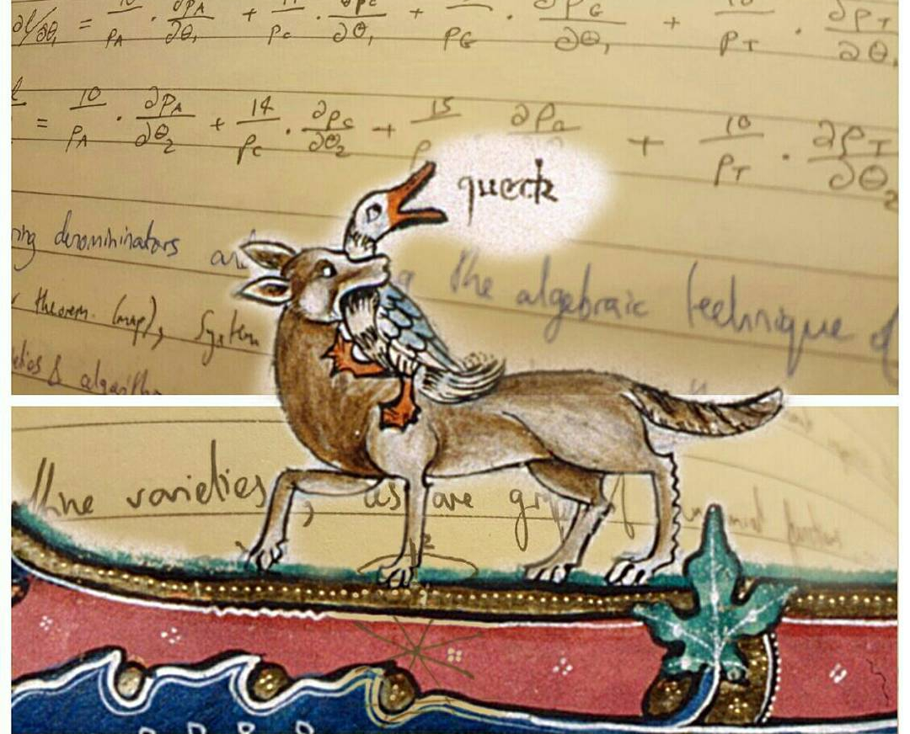

# queck

queck is a research literature gizmo, under construction

> “Seldom do more than a few of nature’s secrets give way at one time.”

— [_The Bandwagon_](http://ieeexplore.ieee.org/stamp/stamp.jsp?arnumber=1056774), Claude Shannon (1956)

## status

Still in 'heavy development' as they say, though signs of life are starting to break through... see the [Wiki](https://github.com/lmmx/queck/wiki)!
